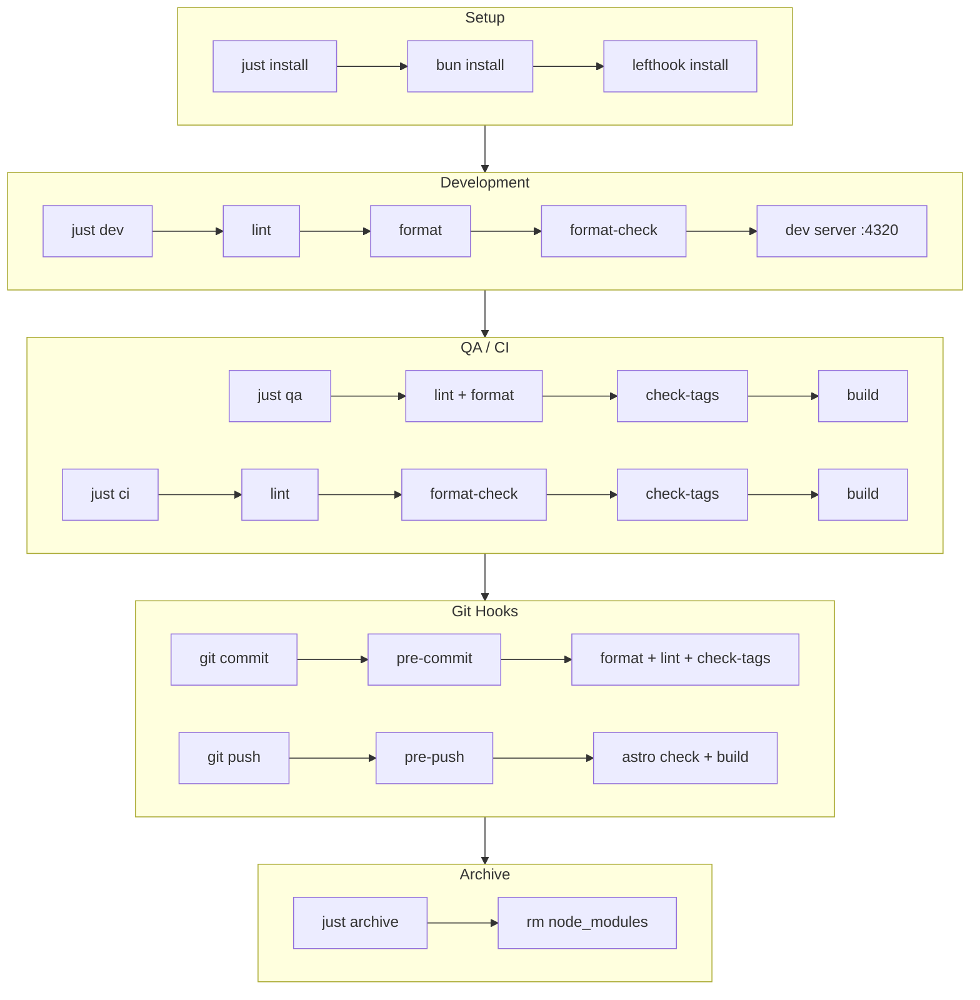

# Workflow de Développement

## Vue d'ensemble

Ce projet utilise un workflow en couches pour garantir la qualité du code:

- **Justfile** - Commandes de développement (`just <recipe>`)
- **Lefthook** - Git hooks automatiques
- **Conductor** - Scripts de workspace

## Diagramme



## Commandes

| Commande | Usage | Description |
|----------|-------|-------------|
| `just i` | Setup | Installer dépendances |
| `just dev` | Dev | Serveur sur port 4320 |
| `just dev 4321` | Dev | Serveur sur port custom |
| `just qa` | Agents | Validation avec autoformat |
| `just ci` | CI | Validation sans autoformat |
| `just build` | Build | Build production |
| `just clean` | Cleanup | Cache seulement |
| `just archive` | Archive | Supprime node_modules |

## Git Hooks (Lefthook)

### Pre-commit (parallèle)

| Job | Commande | Description |
|-----|----------|-------------|
| format | `just format` | Formatte le code |
| format-check | `just format-check` | Vérifie le format |
| lint | `just lint` | ESLint |
| check-tags | `just check-tags` | Valide les tags |

### Pre-push (parallèle)

| Job | Commande | Description |
|-----|----------|-------------|
| check | `just check` | TypeScript/Astro check |
| build | `just build` | Build complet |

## Conductor Scripts

| Script | Commande | Quand |
|--------|----------|-------|
| Setup | `just install` | Création workspace |
| Run | `just dev` | Bouton Run |
| Archive | `just archive` | Archivage workspace |

## Flux de travail typique

```bash
# 1. Setup initial
just install

# 2. Développement
just dev              # ou just dev 4321 pour un autre port

# 3. Avant commit (automatique via lefthook)
# format → format-check → lint → check-tags

# 4. Avant push (automatique via lefthook)
# check → build

# 5. Archivage
just archive
```
