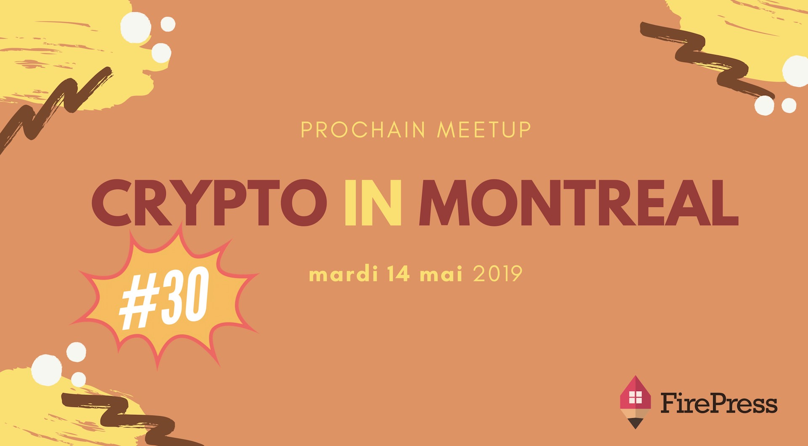

Pour la **30e édition** de Crypto In Montreal, nous aurons deux présentations et deux points de vue. L'événement aura lieu dans le nouvel espace de co-working: [Workbase](https://www.atworkbase.com/).

**À boire** : notre hôte nous offrira gracieusement bière et bouchées.
**À manger** : fruits, chips et goodies. Arrivez tôt!

**Billetterie** et autres détails:
[https://pascalandy.com/blog/cim-30](/blog/cim-30)

## L'ordre du jour

### 1) Bitcoin full node

La force de Bitcoin réside dans son réseau de pairs. Pour pouvoir utiliser Bitcoin à son potentiel maximal, il faut maintenir son propre nœud complet. La résilience et la robustesse de Bitcoin en dépendent.

La présentation couvrira les avantages et les raisons pour maintenir votre propre noeud complet de Bitcoin et du Lightning Network.

- Quels sont les compromis?
- Comment un nœud complet améliore-t-il ma sécurité et ma souveraineté ?
- Nœud complet de l'espace?

La présentation sera donnée par **Maciej Cepnik** , cofondateur de Veriphi, dont le travail consiste à sensibiliser le public aux meilleures pratiques en matière de Bitcoin afin que les particuliers et les entreprises les adoptent le plus rapidement possible.

### 2) Proof-of-stake

L'invité parlera du proof-of-stake dans le contexte de la blockchain Tezos (par exemple, il expliquera le fonctionnement du baking). Il comparera l'implémentation du proof-of-stake de Tezos (liquid proof-of-stake) à une autre variante populaire (delegated proof-of-stake). Il abordera également d'autres aspects de Tezos (histoire, philosophie, gouvernance et amendements potentiels).

**Agenda**

- Courte introduction au projet Tezos
- La différence entre le proof of work et le proof of stake
- Le nothing at stake problem
- Le liquid proof of stake de Tezos
- La différence entre baker et déléguer
- La différence entre le liquid proof of stake de Tezos et le delegated proof of stake de EOS
- Le mécanisme de gouvernance initial de Tezos

L'invité est un des organisateurs du Meetup Tezos Montréal depuis septembre 2018 et un adepte des cryptomonnaies depuis plusieurs années. Il s'intéresse à l'économie, à la finance, à la technologie, aux sciences et aux arts.

Dans tous les cas, je vais m'assurer qu'on passe tous une belle soirée! Notre Meetup favorise les triades, les échanges authentiques et l’apprentissage. C'est pas ta classe boring. C'est du réseautage comme le réseautage devrait être fait. See ya 👩‍⚕️ 👨‍⚕️ 👩‍🌾 👨‍🌾 👩‍🍳 👨‍🍳 👩‍🎓 👨‍🎓 👩‍🎤 👨.

### À propos de l'organisateur

[https://pascalandy.com/blog/qui-est-pascal-andy/](/blog/qui-est-pascal-andy/)

### Le quand, le où, le prix

| @           | Details                                                        |
| ----------- | -------------------------------------------------------------- |
| **Où** :    | Workbase, 486, rue Sainte-Catherine Ouest Montréal, QC H3B 1A6 |
| **Quand** : | Mardi 14 mai 2019 à 17h15                                      |
| **Prix** :  | On s'en occupe, pour toi c'est gratuit.                        |

Merci d'arriver à **17h15 maximum**. On débutera pour 17h30 🙏.

### Billetterie

Réserve ta place parce que ça demande beaucoup d'organisation :

- sur **Meetup** en [cliquant ici](https://www.meetup.com/CryptoInMontreal) 👈
- sur **EventBrite** en [cliquant ici](https://www.eventbrite.ca/o/cryptoinmontreal-15852655206) 👈

_C'est problématique quand les gens **confirment leurs présences**, **mais** qui **ne se présentent pas**. Faire un RSVP, **c'est s'engager** à être présent à l'événement 🙌. Merci de respecter votre engagement._

### Teaser 2019

<iframe width="560" height="315" src="https://www.youtube.com/embed/f3zyNnqi8gg" frameborder="0" allow="accelerometer; autoplay; encrypted-media; gyroscope; picture-in-picture" allowfullscreen></iframe>

### Teaser 2018

<iframe width="560" height="315" src="https://www.youtube.com/embed/2_rPjzXXfBA" frameborder="0" allow="autoplay; encrypted-media" allowfullscreen></iframe>

### 🙌 (TL;DR), en gros

- 🍺 de la boisson
- 🍕 de la bouffe (parfois oui, parfois non)
- 💡 du monde intéressé et intéressant
- ❤️ un sujet passionnant
- 🏒 un présentateur qui n'a pas peur d'aller dans les coins

### Commanditaire officiel

Chez [FirePress](https://firepress.org/), nous nous efforçons de permettre aux entrepreneurs et aux petites organisations de créer leurs sites Web. Nous faisons l'**hébergement de votre site web** en plus d'aider nos clients à se familiariser avec la plate-forme Ghost.

Parce que nous croyons que votre site web doit parler en votre nom, nous considérons que notre mission est complète une fois que votre site est devenu votre impresario.

### Qu'est-ce que t'attends ?

Amène tes fesses parce que c'est difficile de résister à ça si tu me demandes mon avis 🙊. Il te reste juste à faire ta réservation _RSVP_ 🙌.

Cheers!

Pascal Andy | Foundateur de CryptoInMontreal
