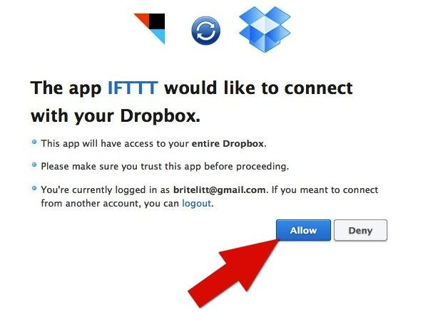

Combien de temps sauveriez-vous si toutes les photos que vous prenez avec votre téléphone pouvaient aussi se retrouver automatiquement sur votre ordinateur? Ne serait-il pas aussi plus sécurisant dans le cas où vous perdiez votre téléphone?

Rien de fashion ici, j’en conviens. Il faut bien commencer par les premiers pas. Ils sont rarement gracieux, mais petit à petit ce sont ces premiers pas qui nous permettront de monter le Mont Everest. Alors vous voulez gagner du temps? Être plus performant sur votre ordinateur? Merveilleux.

## Le secret? Implanter un processus en arrière-plan

J’ai mis en place le processus suivant. À toutes les fois que je prends une photo de mon téléphone (iPhone), celle-ci est transférée automatiquement sur mon ordinateur. C’est ce que j’appelle faire travailler les technologies pour soi-même. C’est le même principe que de mettre en place des paiements préautorisés pour payer ses comptes.

Cette méthode implique trois éléments. Nous aurons besoin de:

1. [Instagram](http://instagram.com/)
2. [Dropbox](http://dropbox.com/)
3. [IFTTT](http://ifttt.com/)

**Instagram** - Instagram est devenu très populaire grâce à ses filtres et à ses effets vintage. C’est d’ailleurs avec un iPhone et Instagram que les photos de ce blog ont été prises. Ici, ce n’est pas les effets artistiques de l’application qui m’intéressent, mais bien le processus d’automatiser le transfert des photos en arrière-plan. Une fois que votre photo est prise, celle-ci est partagée sur les serveurs d’Instagram. Par défaut, l’application partage publiquement vos photos, mais vous pouvez mettre cette option à privé.

**Dropbox** - L’application vous crée un dossier « Dropbox » qui fonctionne de la même façon que tous vos autres dossiers sur votre ordinateur. En arrière-plan, tout ce qui se retrouve dans ce dossier est synchronisé automatiquement (dans les nuages) sur les serveurs de Dropbox. De là, vous pouvez installer l’application sur d’autres ordinateurs, tablettes et téléphones intelligents. Vos fichiers sont toujours synchronisés et accessibles, peu importe où que vous soyez. Puissant. Je dirais même que ça été le début de la mort des clés USB.

**IFTTT** - L’application IFTTT porte son nom de l’acronyme « If This, Than That ». Voici ma traduction: si l’événement X arrive, alors fait l’action Y. Nous appelons cela une recette. IFTTT connecte deux applications ensemble et fait une tâche prédéterminée à notre place.

Dans notre scénario en particulier, la logique est la suivante: Si je prends une nouvelle photo dans Instagram (X), alors copie la photo dans mon Dropbox (Y). EX-TRÊ-ME-MENT PUISSANT! Toutes sortes de possibilités s’ouvrent à nous. Voici par exemple deux autres recettes que j’utilise actuellement:

- Si l’action de Dollorama (DOL.to) descend (X) sous les 60$ l’action, envoie-moi (Y) un courriel de notification.
- Si j’envoie (X) une photo sur Facebook, alors copie (Y) cette photo sur mon compte Flickr. Si X alors Y. Vous me suivez? Bien!

## Comment coordonner IFTTT, Instagram et Dropbox ensemble?

1. Créez un compte & installez Dropbox. Au besoin, vous pouvez suivre les étapes [ici](https://www.youtube.com/watch?v=5AhtstzPZ7U)

2. Créez un compte & installer Instagram sur votre iPhone ou sur votre téléphone Android.

3. Créez votre compte IFTTT. Il n’y a pas d’application à installer. Cette application opère dans sur le site même de https://ifttt.com/

4. Une fois votre compte créé, vous devez maintenant autoriser Dropbox et Instagram. Le site vous demandera les coordonnées de vos comptes. Allez dans la section **Channels**.

5. Cliquez sur l’icon Dropbox.

6. Cliquez sur Activate.

7. Entrez vos coordonnées Dropbox et cliquez sur Sign In.

8. Confirmez l’autorisation. Cliquez sur Allow.

9. Maintenant vous devez faire la même opération pour autoriser Instagram. C’est le même principe. Recommencez à l’étape #4.

Donc, à ce point-ci, je tiens pour acquis que vos deux applications sont autorisées.

10. Allez sur la page de cette recette: https://ifttt.com/recipes/25679 et cliquez sur Use Recipe.

11. Gracias mucho. Le processus est en place. Rock it !!! \_|m/

Maintenant, à toutes les fois que vous prendrez une photo à partir d’Instagram, elle se retrouvera aussi dans votre dossier Dropbox. En général IFTTT synchronise le tout en moins de quinze minutes.

Les photos se retrouvent à cet endroit: dossier dropbox > itfff > instagram

Certaines personnes pourraient me dire que cela se fait aussi par iCloud, le système dédié de Apple. Je déteste iCloud pour plusieurs raisons. Je ne vais pas écrire tout ce qui fait du non-sens à propos d’iCloud dans cet article, mais je peux vous affirmer que plusieurs associés et conseillers chez Apple n’aiment pas plus iCould que moi.

Un des avantages majeurs du processus que nous venons de mettre en place est que la photo est redimensionnée dans un format qui à du « gros bon sens ».

Voici des photos synchronisées avec IFTTT. Avec notre processus les photos prennent **20X moins de place.**

Voici les résultats lorsque vous transférez manuellement (ou avec iCloud) vos photos.

Les photos que produit le iPhone (4) font en moyenne 2000 KO, alors que les photos qui sont transférées dans Dropbox font en moyenne 100 KO. Beaucoup plus léger et beaucoup moins long à transférer par courriel et sur les réseaux sociaux. De plus, les photos sont transférées de votre connexion internet 3G ou WiFi local alors que iCloud ne permet que le transfert en WiFi.

#### 📤 À partager

Toutes les semaines, on prend des dizaines de photos avec notre téléphone. Le problème est justement le fait qu'elles sont sauvegardées uniquement dans notre téléphone…

Voici comment transférer automatiquement ses photos de son téléphone à son ordinateur. /posts/comment-transferer-automatiquement-les-photos-de-son-telephone-a-son-ordinateur/

📷 [source](http://blog.iyogi.com/technology-today/tech-news/how-to-transfer-photos-from-your-digital-camera-to-instagram.html)
